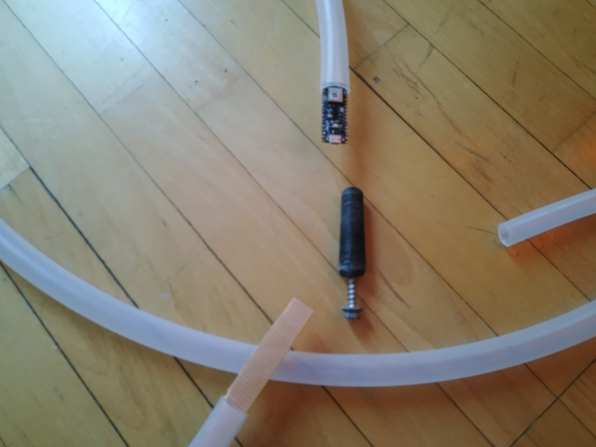
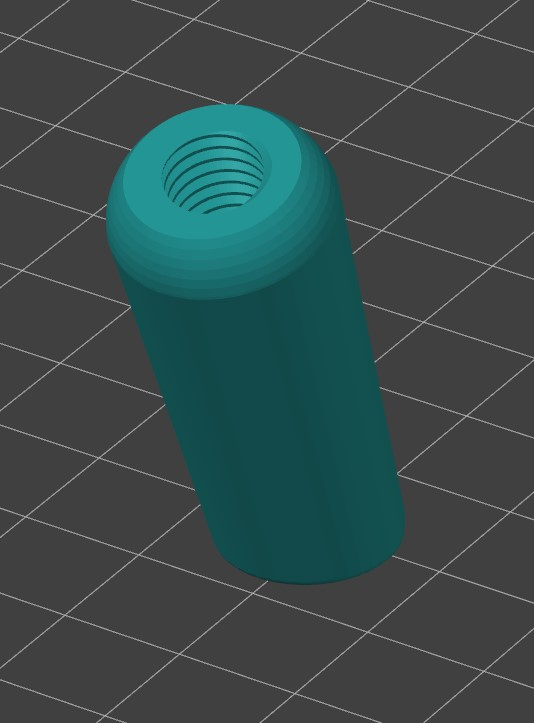

# Assembly #
## Nano ##
As seen from the pic inner diameter of the tube is to small for the Nano

Solution for this is to enlarge the tube to around 17-18mm with friction.

Print out the mandrel.

Screw a M8 bolt to the mandrel. Enlarge the tubing by reaming with the mandrel and a power drill.

Recommend material for the mandrel is anything with carbon fiber, glow in the dark or rough wood pla.

Print a second mandrel a bit larger if the Nano still doesn't fit. Be careful of overheating the tube as it's prone to suddenly deforming when heated.

## Circuitry ##
The vera boards carrying the rest of the circuitry. wwww